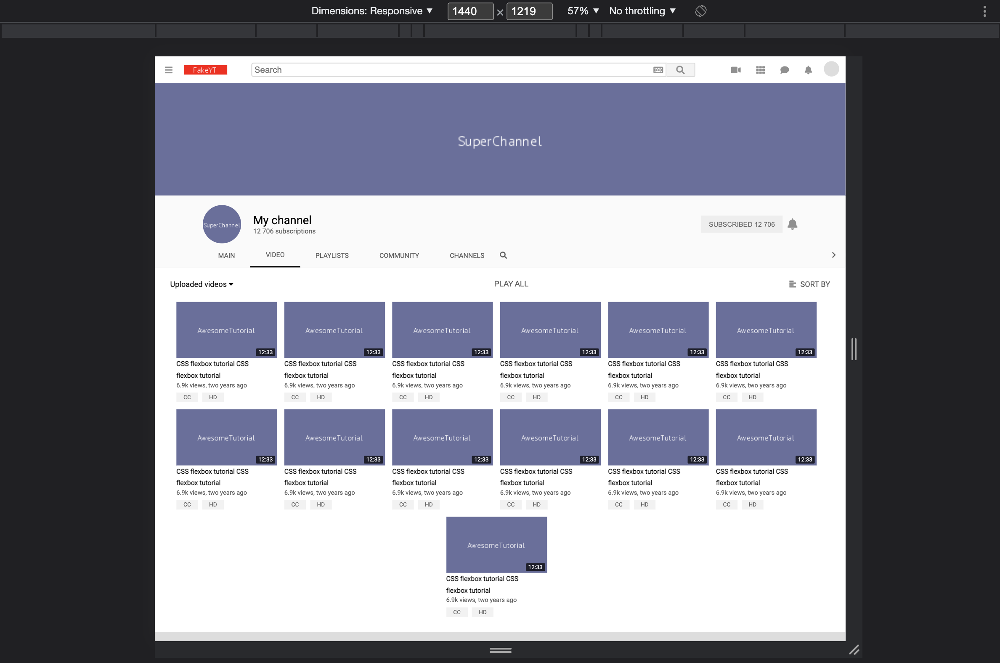
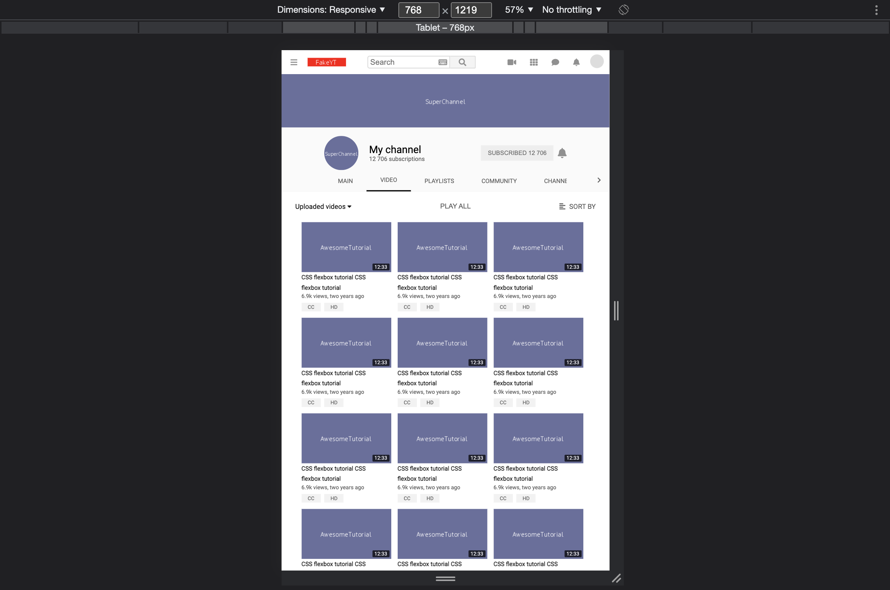
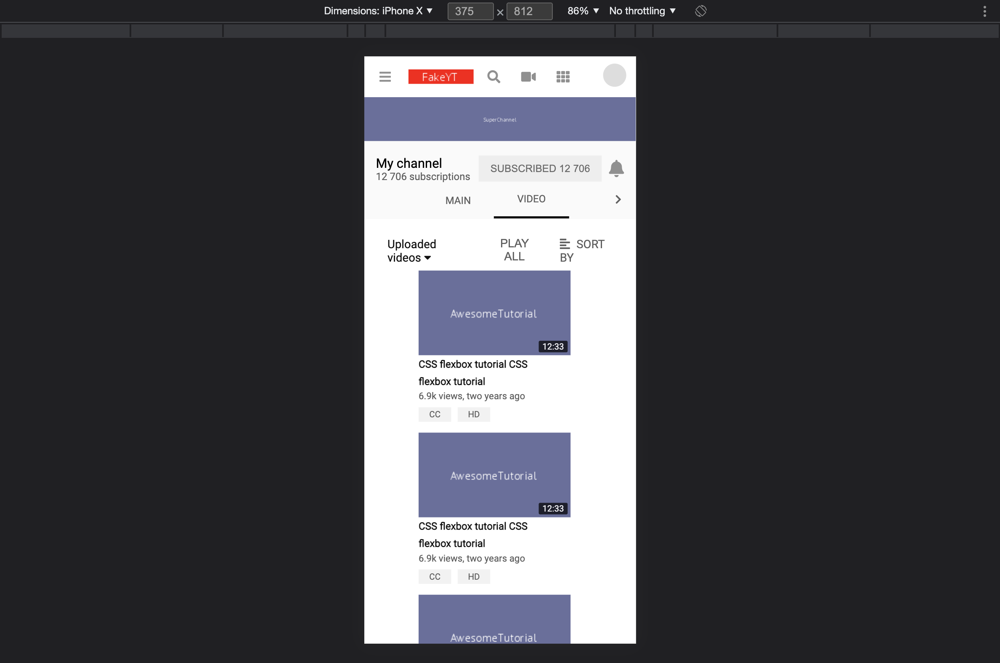

# YouTube Layout Copy

This is an exercise in creating a copy of the YouTube's website layout with CSS Flexbox. This example made in HTML and CSS uses CSS Flexbox styling to create a most-screen friendly website layout.
 

   
   
   

